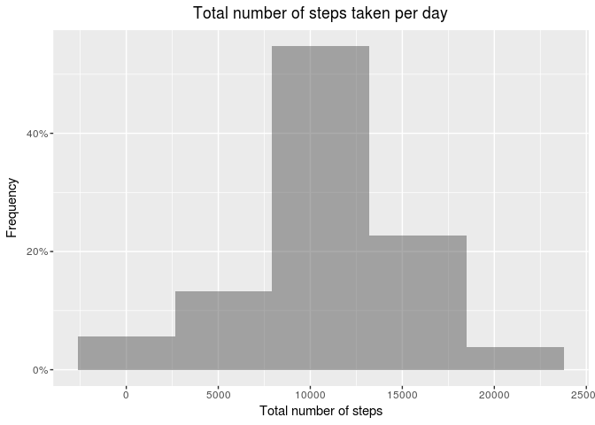
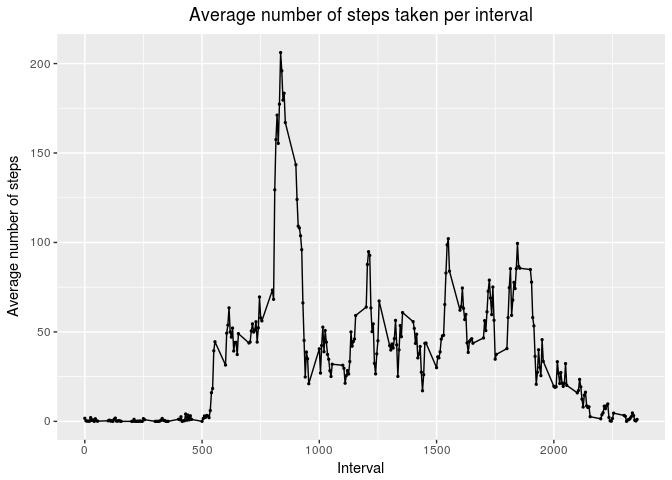
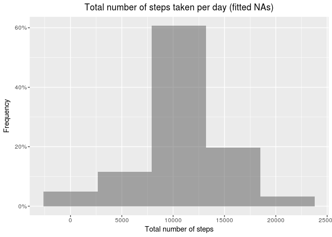
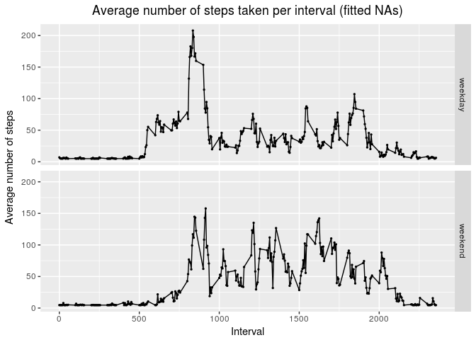

# Reproducible Research: Peer Assessment 1

## Setup R environment


```r
## load required libraries
library(knitr)
library(ggplot2)

## set code and results to show by default 
opts_chunk$set(echo = TRUE, results = 'show')
```


## Loading and preprocessing the data

```r
## unzip data file
unzip(zipfile="activity.zip",exdir=".")

## list files in the directory
dataFilesPath <- file.path(".")
dataFiles<-list.files(dataFilesPath, full.names = TRUE)
dataFiles
```

```
##  [1] "./activity.csv"                  "./activity.zip"                 
##  [3] "./doc"                           "./instructions_fig"             
##  [5] "./PA1_template_files"            "./PA1_template.html"            
##  [7] "./PA1_template.md"               "./PA1_template.Rmd"             
##  [9] "./README.md"                     "./RepData_PeerAssessment1.Rproj"
```

```r
## reading the file
activity <- read.csv(file = dataFiles[1])
```


## What is mean total number of steps taken per day?

```r
## ignore NAs
actualActivity <- activity[complete.cases(activity),]

## calculate the total number of steps taken per day
dailySteps <- aggregate(actualActivity$steps, by = list(actualActivity$date), sum)

## give names to variabels
names(dailySteps) <- c('Date', 'Steps')

## create a histogram of the total number of steps taken each day
(ggplot(data=dailySteps, aes(x = Steps)) 
    + geom_histogram(aes(y =(..count..)/sum(..count..)), alpha=0.5,position='identity',bins=5)
    #+ theme(axis.text.x=element_text(angle = 90, hjust = 0))
    + labs(y = 'Frequency') # label y axis
    + scale_y_continuous(labels = scales::percent) # make the labels as percentages
    + labs(x = 'Total number of steps')
    + labs(title = "Total number of steps taken per day") # add a title
    + theme(plot.title = element_text(hjust = 0.5)) # center the title
)
```

<!-- -->

```r
## Calculate the mean and median of the total number of steps taken per day
meanSteps <- mean(dailySteps$Steps)
medianSteps <- median(dailySteps$Steps)

## report the mean and median
print(paste0('The mean of total steps taken per day is: ', format(meanSteps, digits = 2)))
```

```
## [1] "The mean of total steps taken per day is: 10766"
```

```r
print(paste0('The median of total steps taken per day is :', format(medianSteps, digits = 2)))
```

```
## [1] "The median of total steps taken per day is :10765"
```


## What is the average daily activity pattern?


```r
## calculate the average of steps taken per day
dailyInterval <- aggregate(actualActivity$steps, by = list(actualActivity$interval), mean)

## give names to variabels
names(dailyInterval) <- c('Interval', 'Steps')

## Make a time series plot (i.e. type = "l") of the
##  5-minute interval (x-axis) and the average number of steps taken, averaged across all days (y-axis)
(ggplot(dailyInterval, aes(Interval, Steps))
    + geom_line()
    + geom_point(size=0.5)
    + labs(y = 'Average number of steps')
    + labs(title = "Average number of steps taken per interval") # add a title
    + theme(plot.title = element_text(hjust = 0.5)) # center the title
)
```

<!-- -->

```r
## Which 5-minute interval, on average across all the days in the dataset, contains the maximum number of steps?
maxSteps <- max(dailyInterval$Steps)
dailyInterval[dailyInterval$Steps == maxSteps,]
```

```
##     Interval    Steps
## 104      835 206.1698
```


## Imputing missing values


```r
## Calculate and report the total number of missing values in the dataset (i.e. the total number of rows with NAs)
summary(activity)
```

```
##      steps                date          interval     
##  Min.   :  0.00   2012-10-01:  288   Min.   :   0.0  
##  1st Qu.:  0.00   2012-10-02:  288   1st Qu.: 588.8  
##  Median :  0.00   2012-10-03:  288   Median :1177.5  
##  Mean   : 37.38   2012-10-04:  288   Mean   :1177.5  
##  3rd Qu.: 12.00   2012-10-05:  288   3rd Qu.:1766.2  
##  Max.   :806.00   2012-10-06:  288   Max.   :2355.0  
##  NA's   :2304     (Other)   :15840
```

```r
print(paste0('The total number of rows with NAs are ', sum(is.na(activity$steps))))
```

```
## [1] "The total number of rows with NAs are 2304"
```

```r
## Devise a strategy for filling in all of the missing values in the dataset. The strategy does not need to be sophisticated. For example, you could use the mean/median for that day, or the mean for that 5-minute interval, etc. then mutate the data frame by replacing NA values in steps with the mean of steps for the day 

## change the date format (not necessary for this data set)
activity$date <- as.Date(activity$date, format = '%Y-%m-%d')

## create a month column (can also do day-month as '%m-%d' but does NOT work as data from whole date is missing e.g. 01/10/2012)
activity$dayMonth <- strftime(activity$date, format = '%m')

## compute the average of the month combination
activity <- transform(activity, mavg = ave(steps, dayMonth, FUN = function(x) mean(x, na.rm = TRUE) ))

## replace the missing value with the mean
filledActivity <- transform(activity, steps = ifelse(is.na(steps), mavg, steps) )

## Make a histogram of the total number of steps taken each day 
## calculate the total number of steps taken per day
filledDailySteps <- aggregate(filledActivity$steps, by = list(filledActivity$date), sum)

## give names to variabels
names(filledDailySteps) <- c('Date', 'Steps')

## create a histogram of the total number of steps taken each day
(ggplot(data=filledDailySteps, aes(Steps)) 
    + geom_histogram(aes(y =(..count..)/sum(..count..)), alpha=0.5,position='identity',bins=5)
    #+ theme(axis.text.x=element_text(angle = 90, hjust = 0))
    + labs(y = 'Frequency') # label y axis
    + scale_y_continuous(labels = scales::percent) # make the labels as percentages
    + labs(x = 'Total number of steps')
    + labs(title = "Total number of steps taken per day (fitted NAs)") # add a title
    + theme(plot.title = element_text(hjust = 0.5)) # center the title
)
```

<!-- -->

```r
## Calculate the mean and median of total number of steps taken per day.
filledMeanSteps <- mean(filledDailySteps$Steps)
filledMedianSteps <- median(filledDailySteps$Steps)

## report the mean and median of total number of steps taken per day
print(paste0('The mean of total steps taken per day (filled) is: ', format(meanSteps, digits = 2)))
```

```
## [1] "The mean of total steps taken per day (filled) is: 10766"
```

```r
print(paste0('The median of total steps taken per day (filled) is :', format(medianSteps, digits = 2)))
```

```
## [1] "The median of total steps taken per day (filled) is :10765"
```

```r
## Do these values differ from the estimates from the first part of the assignment?
## What is the impact of imputing missing data on the estimates of the total daily number of steps?

all.equal(meanSteps, filledMeanSteps)
```

```
## [1] "Mean relative difference: 0.0001740854"
```

```r
all.equal(medianSteps, filledMedianSteps)
```

```
## [1] "Mean relative difference: 0.002333953"
```


## Are there differences in activity patterns between weekdays and weekends?

```r
## convert date variable to date class
filledActivity$date <- as.Date(filledActivity$date)

## add new variable 'day' that contains either weekend or weekday as factor variable with 2 levels
filledActivity$day <- factor(ifelse(weekdays(filledActivity$date) %in% c('Saturday', 'Sunday'), 'weekend', 'weekday'))

## split the dataframe into two data frames based on weekday or weekend
filledActivityWeekday <- filledActivity[filledActivity$day == 'weekday', ]
filledActivityWeekend <- filledActivity[filledActivity$day == 'weekend', ]

## calculate the total number of steps taken per day
filledWeekdayInterval <- aggregate(filledActivityWeekday$steps, by = list(filledActivityWeekday$interval), mean)

## add a variable that has a value of 'weekday'
filledWeekdayInterval$day <- 'weekday'

## give names to variabels
names(dailyInterval) <- c('Interval', 'Steps')

## calculate the total number of steps taken per day
filledWeekendInterval <- aggregate(filledActivityWeekend$steps, by = list(filledActivityWeekend$interval), mean)

## add a variable that has a value of 'weekend'
filledWeekendInterval$day <- 'weekend'

## merge the summerised dataframes
filledDailyIntervals <- rbind(filledWeekdayInterval, filledWeekendInterval)

## give names to variabels
names(filledDailyIntervals) <- c('Interval', 'Steps', 'Day')

## Make a panel plot containing a time series plot (i.e. type = "l") of the 5-minute interval (x-axis) 
##  and the average number of steps taken, averaged across all weekday days or weekend days (y-axis). 

(ggplot(filledDailyIntervals, aes(Interval, Steps))
    + geom_line()
    + geom_point(size=0.5)
    + labs(y = 'Average number of steps')
    + labs(title = "Average number of steps taken per interval (fitted NAs)") # add a title
    + theme(plot.title = element_text(hjust = 0.5)) # center the title
    + facet_grid(Day ~ .)
)
```

<!-- -->
