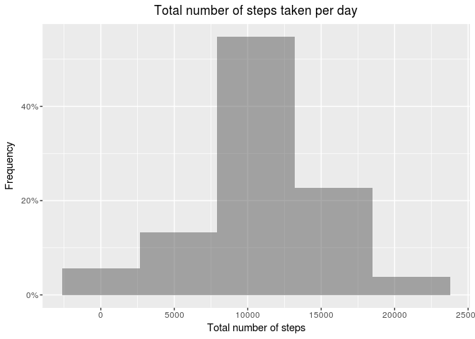
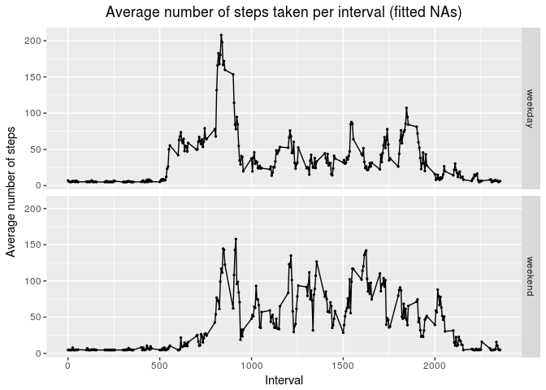

# DataScience-ReproducibleResearch

This course contains two projects. For details about each of the projects, click on the following links:

* [Project01](https://github.com/FirasSadiyah/DataScience-ReproducibleResearch/blob/master/PA1_template.md)
* [Project02](https://github.com/FirasSadiyah/DataScience-ReproducibleResearch/blob/master/RepResearch_Project2.md)

Project 01 Plots:

<!-- -->

<!-- -->

<!-- -->

<!-- -->

Project 02 Plots:

<!-- -->

<!-- -->

