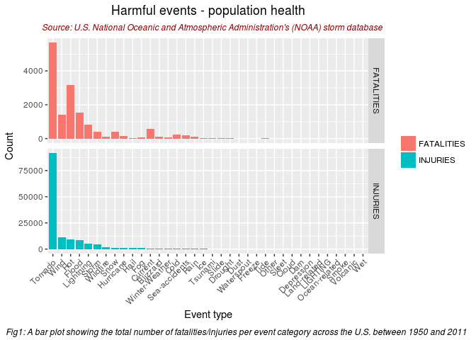
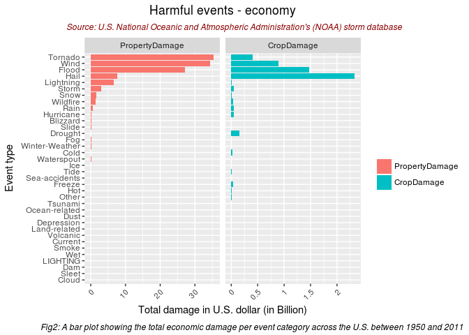

# The effects of weather conditions on public health and economy in the United States.
Firas Sadiyah  
2017-07-30  


## Synopsis
The following steps were followed in order to analyse the data:

* The data set was downloaded and imported into R as a data frame.
* The event type (EVTYPE) variable contains many categories (985) including repetitive items, spelling mistakes and unidentified categories. 
* The major challenge was to reduce the levels of this variable to a manageable number of categories.
* The reduction benefits from the gsub() function as well as the regular expression and resulted in 36 categories. 
* The data set were summarised by calculating the total number of fatalities and injuries per event category. 
* For the second part, the data set contained two variables PROPDMGEXP and CROPDMGEXP which contains unit such as h (hundreds), k (thousands), etc..
* Firstly, the values in these variables were substitutes by their corresponding values. 
* Secondly, the values of PROPDMGEXP and CROPDMGEXP were multiplied by the values of PROPDMG and CROPDMG respectively to generate the total damage.


## Summary
The basic goal of this project is to explore the NOAA Storm Database and answer the following questions: 

* Across the United States, which types of events are most harmful with respect to population health?
* Across the United States, which types of events have the greatest economic consequences?

The data is available [here](https://d396qusza40orc.cloudfront.net/repdata%2Fdata%2FStormData.csv.bz2) [47MB]

The documentation of the database:

* National Weather Service Storm Data Documentation [here](https://d396qusza40orc.cloudfront.net/repdata%2Fpeer2_doc%2Fpd01016005curr.pdf)
* National Climatic Data Centre Storm Events FAQ [here](https://d396qusza40orc.cloudfront.net/repdata%2Fpeer2_doc%2FNCDC%20Storm%20Events-FAQ%20Page.pdf)

## Data Processing

### Getting and reading the data


```r
##### Load the reqruied libraries #####
library(dplyr)
```

```
## 
## Attaching package: 'dplyr'
```

```
## The following objects are masked from 'package:stats':
## 
##     filter, lag
```

```
## The following objects are masked from 'package:base':
## 
##     intersect, setdiff, setequal, union
```

```r
library(ggplot2)
library(reshape2)

##### Getting and reading the data #####

# check if a folder ./data exists, if not, create one
if(!file.exists("./data")){dir.create("./data")} 

# check if the dataset exists, if not, download it
if(!file.exists("./data/StormData.csv.bz2")){    
fileUrl <- "https://d396qusza40orc.cloudfront.net/repdata%2Fdata%2FStormData.csv.bz2"
download.file(fileUrl,destfile="./data/StormData.csv.bz2",method="curl")
} else {
    # read the data set into a data frame called 'stromData'
    stromData <- read.csv(file = './data/StormData.csv.bz2') 
}
```

### Transforming the data


```r
# List all event types and their frequency
evtypeFreq <- stromData %>% 
    group_by(EVTYPE) %>%
    summarise(levels_nr = length(EVTYPE)) %>%
    arrange(desc(levels_nr))

# frequency of event types
evtypeFreq 
```

```
## # A tibble: 985 x 2
##                EVTYPE levels_nr
##                <fctr>     <int>
##  1               HAIL    288661
##  2          TSTM WIND    219940
##  3  THUNDERSTORM WIND     82563
##  4            TORNADO     60652
##  5        FLASH FLOOD     54277
##  6              FLOOD     25326
##  7 THUNDERSTORM WINDS     20843
##  8          HIGH WIND     20212
##  9          LIGHTNING     15754
## 10         HEAVY SNOW     15708
## # ... with 975 more rows
```


```r
# Determine the number of event types
length(unique(stromData$EVTYPE))
```

```
## [1] 985
```


```r
# Subset stromData and keep only the relevant variables: EVTYPE, FATALITIES, INJURIES, PROPDMG, PROPDMGEXP, CROPDMG, CROPDMGEXP
subData <- subset(stromData, select = c('BGN_DATE', 'EVTYPE', 'FATALITIES', 'INJURIES', 'PROPDMG', 'PROPDMGEXP', 'CROPDMG', 'CROPDMGEXP'))

# clean the data by consolidating various event types into general categories
# this will reduce the 985 variable types to 36 variable categories 
subData$EVTYPE <- as.factor(sub('.*tornado.*|.*TORNDAO.*|.*GUSTNADO.*|.*FUNNEL.*|.*MICROBURST.*|.*TURBULENCE.*|.*DOWNBURST.*', 'Tornado', subData$EVTYPE, ignore.case = TRUE))
subData$EVTYPE <- as.factor(gsub('.*wnd.*|.*wind.*', 'Wind', subData$EVTYPE, ignore.case = TRUE))
subData$EVTYPE <- as.factor(gsub('.*tsunami.*', 'Tsunami', subData$EVTYPE, ignore.case = TRUE))
subData$EVTYPE <- as.factor(gsub('.*hurricane.*|.*typhoon.*|.*FLOYD.*', 'Hurricane', subData$EVTYPE, ignore.case = TRUE))
subData$EVTYPE <- as.factor(gsub('.*tide.*', 'Tide', subData$EVTYPE, ignore.case = TRUE))
subData$EVTYPE <- as.factor(gsub('.*blizzard.*', 'Blizzard', subData$EVTYPE, ignore.case = TRUE))
subData$EVTYPE <- as.factor(gsub('.*flood.*|.*fld.*', 'Flood', subData$EVTYPE, ignore.case = TRUE))
subData$EVTYPE <- as.factor(gsub('.*debris.*', 'Debris', subData$EVTYPE, ignore.case = TRUE))
subData$EVTYPE <- as.factor(gsub('.*fog.*|.*vog.*', 'Fog', subData$EVTYPE, ignore.case = TRUE))
subData$EVTYPE <- as.factor(gsub('.*snow.*|*avalanche.*|.*AVALANCE.*', 'Snow', subData$EVTYPE, ignore.case = TRUE))
subData$EVTYPE <- as.factor(gsub('.*rain.*|.*shower*.|.*spell.*|.*PRECIP.*', 'Rain', subData$EVTYPE, ignore.case = TRUE))
subData$EVTYPE <- as.factor(gsub('.*lightning.*|.*LIGNTNING.*|.*TSTM.*', 'Lightning', subData$EVTYPE, ignore.case = TRUE))
subData$EVTYPE <- as.factor(gsub('.*hail.*', 'Hail', subData$EVTYPE, ignore.case = TRUE))
subData$EVTYPE <- as.factor(gsub('.*frost.*|.*freez.*', 'Freeze', subData$EVTYPE, ignore.case = TRUE))
subData$EVTYPE <- as.factor(gsub('.*storm.*', 'Storm', subData$EVTYPE, ignore.case = TRUE))
subData$EVTYPE <- as.factor(gsub('.*dust.*', 'Dust', subData$EVTYPE, ignore.case = TRUE))
subData$EVTYPE <- as.factor(gsub('.*dry.*|.*drought.*|.*DRIEST.*', 'Drought', subData$EVTYPE, ignore.case = TRUE))
subData$EVTYPE <- as.factor(gsub('.*cloud.*', 'Cloud', subData$EVTYPE, ignore.case = TRUE))
subData$EVTYPE <- as.factor(gsub('.*fire.*', 'Wildfire', subData$EVTYPE, ignore.case = TRUE))
subData$EVTYPE <- as.factor(gsub('.*ash.*|.*volcan.*', 'Volcanic', subData$EVTYPE, ignore.case = TRUE))
subData$EVTYPE <- as.factor(gsub('.*surf*.', 'Surf', subData$EVTYPE, ignore.case = TRUE))
subData$EVTYPE <- as.factor(gsub('.*spout.*', 'Waterspout', subData$EVTYPE, ignore.case = TRUE))
subData$EVTYPE <- as.factor(gsub('.*winter.*|.*wintry.*', 'Winter-Weather', subData$EVTYPE, ignore.case = TRUE))
subData$EVTYPE <- as.factor(gsub('.*depression.*', 'Tropical depression', subData$EVTYPE, ignore.case = TRUE))
subData$EVTYPE <- as.factor(gsub('.*sleet.*', 'Sleet', subData$EVTYPE, ignore.case = TRUE))
subData$EVTYPE <- as.factor(gsub('.*current.*', 'Current', subData$EVTYPE, ignore.case = TRUE))
subData$EVTYPE <- as.factor(gsub('.*wet.*', 'Wet', subData$EVTYPE, ignore.case = TRUE))
subData$EVTYPE <- as.factor(gsub('.*cool.*|.*LOW.*|.*cold.*', 'Cold', subData$EVTYPE, ignore.case = TRUE))
subData$EVTYPE <- as.factor(gsub('.*ice.*|.*icy.*|.*glaze.*', 'Ice', subData$EVTYPE, ignore.case = TRUE))
subData$EVTYPE <- as.factor(gsub('.*slide.*', 'Slide', subData$EVTYPE, ignore.case = TRUE))
subData$EVTYPE <- as.factor(gsub('.*depression.*', 'Depression', subData$EVTYPE, ignore.case = TRUE))
subData$EVTYPE <- as.factor(gsub('.*dam.*', 'Dam', subData$EVTYPE, ignore.case = TRUE))
subData$EVTYPE <- as.factor(gsub('.*smoke.*', 'Smoke', subData$EVTYPE, ignore.case = TRUE))
subData$EVTYPE <- as.factor(gsub('.*temp.*|.*high.*|.*heat.*|.*warm.*|.*hot.*', 'Hot', subData$EVTYPE, ignore.case = TRUE))
subData$EVTYPE <- as.factor(gsub('.*swell.*|.*marine.*|.*stream.*|.*wave.*|.*seiche.*|.*surf.*|.*sea.*|.*high[[:blank:]]water.*|.*RISING[[:blank:]]WATER.*|.*DROWNING.*', 'Sea-accidents', subData$EVTYPE, ignore.case = TRUE))
subData$EVTYPE <- as.factor(gsub('.*EROSION.*|.*EROSIN.*', 'Ocean-related', subData$EVTYPE, ignore.case = TRUE))
subData$EVTYPE <- as.factor(gsub('.*land.*', 'Land-related', subData$EVTYPE, ignore.case = TRUE))
subData$EVTYPE <- as.factor(gsub('.*\\?.*|.*other.*|.*summary.*|.*none.*|.*no[[:blank:]]severe.*|.*SOUTHEAST.*|.*URBAN[[:blank:]]SMALL.*|.*NORTHERN[[:blank:]]LIGHTS.*|.*APACHE[[:blank:]]COUNTY.*|.*HEAVY[[:blank:]]MIX.*|.*red.*|.*MILD.*|.*EXCESSIVE.*|.*small.*', 'Other', subData$EVTYPE, ignore.case = TRUE))
```


```r
# Determine the reduced number of event types
length(unique(subData$EVTYPE))
```

```
## [1] 36
```


```r
# subset subData and keep only EVTYPE, FATALITIES, and INJURIES (relevant to answer the first question)
subData1 <- subset(subData, select = c('EVTYPE', 'FATALITIES', 'INJURIES'))

# Summarise subData1 by event type and collapse (i.e. sum) both FATALITIES and INJURIES
subData1 <- subData1 %>% 
    group_by(EVTYPE) %>%
    summarise_all(funs(sum)) %>%
    arrange(desc(INJURIES))

    
# Melt the subData1 to prepare for plotting
subData1 <- melt(subData1, id.vars = 'EVTYPE') 
```


```r
# subset subData and keep only EVTYPE, FATALITIES, and INJURIES (relevant to answer the first question)
subData2 <- subset(subData, select = c('EVTYPE', 'PROPDMG', 'PROPDMGEXP', 'CROPDMG', 'CROPDMGEXP'))

# list all levels of PROPDMGEXP
unique(subData$PROPDMGEXP)
```

```
##  [1] K M   B m + 0 5 6 ? 4 2 3 h 7 H - 1 8
## Levels:  - ? + 0 1 2 3 4 5 6 7 8 B h H K m M
```

```r
# substitute each level with its corresponding values
subData2$PROPDMGEXP <- plyr::mapvalues(subData2$PROPDMGEXP, from=c('', '-', '+', '?', '0', 'h', 'H', 'K', 'm', 'M', 'B'), to=c('1', '1', '1', '1', '1', '100', '100', '1000', '1000000', '1000000', '1000000000'))

# convert PROPDMGEXP from factor class to numeric
subData2$PROPDMGEXP <- as.numeric(subData2$PROPDMGEXP)

# list all levels of CROPDMGEXP
unique(subData2$CROPDMGEXP)
```

```
## [1]   M K m B ? 0 k 2
## Levels:  ? 0 2 B k K m M
```

```r
# substitute each level with its corresponding values
subData2$CROPDMGEXP <- plyr::mapvalues(subData2$CROPDMGEXP, from=c('', '?', '0', 'k', 'K', 'm', 'M', 'B'), to=c('1', '1', '1', '1000', '1000', '1000000', '1000000', '1000000000'))

# convert PROPDMGEXP from factor class to numeric
subData2$CROPDMGEXP <- as.numeric(subData2$CROPDMGEXP)
```


```r
# mutate subData2 to include new variables:
# PropertyDamage (PROPDMG * PROPDMGEXP) and 
# CropDamage (CROPDMG * CROPDMGEXP)
subData2 <- subData2 %>% mutate('PropertyDamage' = PROPDMG * PROPDMGEXP)
subData2 <- subData2 %>% mutate('CropDamage' = CROPDMG * CROPDMGEXP)

# Keep only the relevant variables 'EVTYPE', 'PropertyDamage', 'CropDamage'
subData2 <- subset(subData2, select = c('EVTYPE', 'PropertyDamage', 'CropDamage'))

# Summarise subData2 by event type and collapse (i.e. sum) both PropertyDamage and CropDamage
subData2 <- subData2 %>% 
    group_by(EVTYPE) %>%
    summarise_all(funs(sum)) %>%
    arrange(desc(PropertyDamage))
    
# Melt the subData2 to prepare for plotting
subData2 <- melt(subData2, id.vars = 'EVTYPE') 
```

## Results

According to my data analysis:

* Tornado is the most  most harmful to population health at both fatalities and injuries levels across the U.S. between 1950 and 2011.  


```r
# Generate the first plot showing the total number of FATALITIES/INJURIES per EVTYPE
(ggplot(subData1, aes(x=reorder(EVTYPE, -value), y=value, fill=variable)) 
    + facet_grid(variable ~ ., scales = "free") # scales = 'free' to allow different y axes
    + geom_bar(stat='identity', position='dodge')
    + labs(y = 'Count') # add y label
    + labs(x = 'Event type') # add x label
    + labs(title = "Harmful events - population health") # add a title
    + theme(plot.title = element_text(hjust = 0.5)) # centre the title
    + theme(axis.text.x = element_text(angle = 45, hjust = 1)) # rotate x axis labels
    + guides(fill=guide_legend(title="")) # suppress the legend title
    + labs(subtitle = "Source: U.S. National Oceanic and Atmospheric Administration's (NOAA) storm database")
    + theme(plot.subtitle=element_text(size=9, hjust=0.3, face="italic", color="darkred"))
    + labs(caption = "Fig1: A bar plot showing the total number of fatalities/injuries per event category across the U.S. between 1950 and 2011")
    + theme(plot.caption = element_text(size=9, vjust=0, hjust=0.3, face="italic", color="black"))
)
```

<!-- -->

* Tornado remains the greatest source of economic damage to properties. On the other hand, hail have the greatest economic consequences on crops.


```r
# Generate the second plot showing the total economical damage per EVTYPE
(ggplot(subData2, aes(x=reorder(EVTYPE, value), y=value, fill=variable))
    + facet_grid(. ~ variable, scales = "free")   # scales = 'free' to allow different y axes
    + geom_bar(stat='identity', position='dodge')
    + labs(y = 'Total damage in U.S. dollar (in Billion)')        # add y label
    + labs(x = 'Event type')                      # add x label
    + labs(title = 'Harmful events - economy') # add a title
    + theme(plot.title = element_text(hjust = 0.5)) # centre the title
    + theme(axis.text.x = element_text(angle = 45, hjust = 1)) # rotate x axis labels
    + guides(fill=guide_legend(title="")) # suppress the legend title
    + scale_y_continuous(labels=function(x)x/1000000) # change the unit of x axis to billion
    + coord_flip()
    + labs(subtitle = "Source: U.S. National Oceanic and Atmospheric Administration's (NOAA) storm database")
    + theme(plot.subtitle=element_text(size=9, hjust=0.3, face="italic", color="darkred"))
    + labs(caption = "Fig2: A bar plot showing the total economic damage per event category across the U.S. between 1950 and 2011")
    + theme(plot.caption = element_text(size=9, vjust=0, hjust=0.3, face="italic", color="black"))
)
```

<!-- -->

